<div align="center">

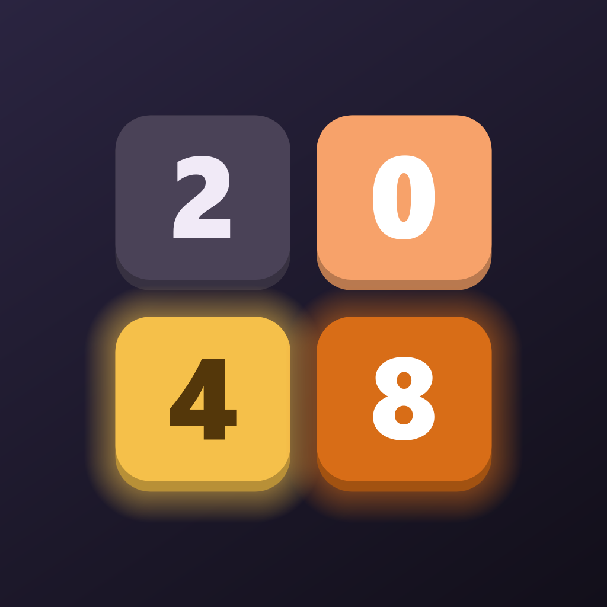

# 2048 Merge

**Offline number-merging puzzle for Android: no ads, no network, no tracking**
<br>
**Числовая головоломка со слияниями для Android: без рекламы, без интернета, без трекинга**

[](https://github.com/Mahiron-hq/2048/releases/latest)
[](https://github.com/Mahiron-hq/2048/actions/workflows/ci.yml)
[](LICENSE)
[](#)
[](https://godotengine.org/)

### [⬇️ Download / Скачать](https://github.com/Mahiron-hq/2048/releases/latest)

**[English](#-english)** · **[Русский](#-русский)** · **[Screenshots / Скриншоты](#-screenshots--скриншоты)**

</div>

---

## 🇬🇧 English

2048 Merge is the classic sliding-tile puzzle. A swipe moves every tile one way, and equal numbers merge into one when they collide. Play on a 3×3, 4×4, 5×5 or 6×6 board. There is no hard finish: play goes on past 2048. A game ends only when the board is full and no moves are left.

All graphics and sound effects are generated by code at runtime, and an original soundtrack, **"2048 Quiet Tiles"**, plays underneath. The APK is about 30 MB, almost all of it the engine and the music.

### Features

| | |
|---|---|
| 🎯 **Faithful 2048 rules** | One merge per tile per move, spawns 2 (90%) or 4 (10%). |
| 🔲 **Four board sizes** | 3×3, 4×4, 5×5 and 6×6, picked from a menu next to "New game". Records are kept per size |
| 💡 **Move hints** | The bulb shows the best move, found by an expectimax search (the method behind the strongest 2048 bots), by gently nudging the tiles that way; after 15 idle seconds it lights up by itself. Can be turned off in settings |
| ↩️ **Undo, your way** | 0 to 5 steps back (default 1) in Game settings. The move plays backwards: tiles glide home, merged tiles split apart, and it never goes past the start of the game |
| 📊 **Statistics** | Games played, average score, best tile, best score, total moves and time played, overall or per board size |
| 🎉 **Milestones** | 128 / 256 / 512 / 1024 / 2048 / … bring a banner, confetti and a chime, once per game |
| 👆 **Swipe hint** | Each new game shows a translucent hint with arrows over the board that disappears after the first move |
| 📱 **Phones and tablets, any orientation** | Portrait and landscape layouts for every screen; in landscape the board sits in the middle with the score and best score against its edges. Controls keep their physical size when the device turns |
| 🌗 **Themes: auto, light and dark** | Auto follows the phone's light or dark mode, even while you play; both themes are built on the same color roles and switch with a smooth crossfade |
| 🖼️ **Graphics quality** | Low (720p), medium (1080p) or high (up to 2K): the picture renders at that resolution and never above the screen's own, so lower quality saves battery on sharp screens |
| 🌐 **English & Russian** | Picked from the system language, switchable in settings |
| 💾 **Autosave** | Records, statistics, settings and the game in progress (with its undo history) are saved after every move. Writes are atomic, so killing the process never corrupts the file |
| 📳 **Haptics that grow with the tiles** | Merging 2s is silent; from 4s up to 65536 every merge is a step stronger, and a lost game ends with soft waves. Tuned to the phone's motor and felt even when the system vibration is off: only the game's own switch decides |
| 🎵 **Original music** | "2048 Quiet Tiles"; separate 7-step volume for music and effects |
| 🔋 **Battery friendly, 60–144 Hz** | Idle screens redraw nothing; animation runs as fast as the screen and the system refresh rate setting allow, or at a frame cap you choose: 30, 60, 90 or 120 (only the caps your screen can show evenly are offered) |
| 🔤 **Same look on every phone** | The Manrope font ships with the game, with digits of equal width so the score never jumps; the phone maker's built-in font cannot replace it |
| 🔒 **No extra permissions** | The only permission is vibration. No `INTERNET`, ads, analytics or purchases |

### Install

1. Open the [latest release](https://github.com/Mahiron-hq/2048/releases/latest) and download an APK:
   - **`…-arm64-v8a.apk`** for virtually every phone and tablet from recent years. If unsure, take this one.
   - **`…-armeabi-v7a.apk`** for older 32-bit devices where the first one won't install.
2. Open the file on your device and allow installs from that source if Android asks.

Or from a computer: `adb install -r 2048-Merge-v1.3.0-arm64-v8a.apk`

The `.aab` file in the release is the bundle for Google Play; it does not install on a phone directly.

> Requires Android 8.0 (API 26) or newer. New versions install over old ones and keep your records, statistics and settings.

### How to play

- **Swipe** in any direction to move all tiles. Equal numbers merge, and their sum is added to your score.
- Pick the **board size** with the button left of **New game** in the menu.
- **The bulb** shows a suggested move: the tiles lean that way twice. The move itself is yours to make.
- **Undo** plays the last move backwards. The number on the button shows how many steps you can still take back.
- Android **Back** goes to the menu, and from the menu closes the game. Your game is saved either way.
- **Settings → App settings:** sound and music with volume sliders, vibration, theme (Auto, Light, Dark), language, graphics quality, FPS counter, frame rate limit. **Game settings:** move hints, undo depth.

### Frame rate limit and battery

The game only draws while something moves; a still screen costs almost nothing. The limit in Settings caps the frame rate of animations (and of the constant redraw the FPS counter needs). Measured on an Infinix phone (Android 16, Mali-G57, screen at 120 Hz) with the FPS counter on, so frames are drawn continuously:

| Limit | Frames drawn | Game CPU time | Its GPU driver threads | System compositor |
|---|---|---|---|---|
| ∞ (120 Hz) | 120/s | 91% of a core | 20% | 45% |
| 60 | 60/s | 56% (−38%) | 13% | 41% |
| 30 | 30/s | 37% (−59%) | 9% | 22% |
| Idle, counter off | none | 11% (half of it is music) | 0% | 0.5% |

The GPU draws the same picture every frame, so its work falls with the number of frames: by half at 60 and by three quarters at 30 (the phone does not expose GPU load directly, but the driver threads above follow the same trend). A cap of 60 paces perfectly on 120 Hz screens; 30 can jitter slightly on phones that keep every app at 120 Hz.

### Music

The soundtrack, **"2048 Quiet Tiles"**, was written for the game by [mahiron-hq](https://github.com/Mahiron-hq).

- ▶️ Listen on YouTube: https://youtu.be/hd3Zw0SmdUE
- 💿 Download in full quality (FLAC, 44.1 kHz): [`2048_Quiet_Tiles.flac`](https://github.com/Mahiron-hq/2048/releases/download/soundtrack/2048_Quiet_Tiles.flac). It is kept in a release so the repository stays light; to rebuild the game MP3, put it in `assets/music/`

The track ends exactly on a bar line, so the game loops it with no gap and no rhythm drift. The in-game MP3 is built from the FLAC by [`tools/make_game_music.py`](tools/make_game_music.py): the track stays whole, and a short fading tail after the loop point, a continuation of the ringing bass, overlaps softly onto the start of the next bar. An automated test checks the seam against a reference excerpt of the master.

### Build from source

You need **Godot 4.7.2** (standard or .NET), the 4.7.2 export templates, **JDK 17** and the **Android SDK** (platform 36, build-tools 36.1.0). Point Godot's editor settings at the SDK and JDK.

```bash
git clone https://github.com/Mahiron-hq/2048.git
cd 2048

# The signing key comes from the environment; the repo holds no secrets
export GODOT_ANDROID_KEYSTORE_RELEASE_PATH=/path/to/release.jks
export GODOT_ANDROID_KEYSTORE_RELEASE_USER=alias
export GODOT_ANDROID_KEYSTORE_RELEASE_PASSWORD=secret

godot --headless --path . --install-android-build-template --export-release "Android" build/2048-merge.apk
godot --headless --path . --export-release "Android armeabi-v7a" build/2048-merge-armv7.apk
godot --headless --path . --export-release "Android AAB" build/2048-merge.aab   # Google Play bundle
```

You can play and debug on a PC with `godot --path .` (mouse drag = swipe, arrows/WASD, `Z` to undo, `H` for a hint, `Esc` for back; resize the window to try landscape).

Tests run headless:

```bash
godot --headless --path . --script res://tests/run_tests.gd   # rules, sizes, undo, persistence, statistics, palette contrast, music seam
godot --headless --path . --script res://tests/ui_smoke.gd    # the whole UI flow through real input, incl. landscape and quality levels
godot --path . --script res://tests/layout_shots.gd            # every screen, both themes, six screen shapes (needs a GPU)
```

Store media (screenshots, banners, icon, video) are generated from the game itself by the scripts in `tools/`.

### Continuous integration

- **[Tests](.github/workflows/ci.yml)**: every push and pull request imports the project and runs both test suites on Godot 4.7.2 (Linux).
- **[Release](.github/workflows/release.yml)**: a tag `vX.Y.Z` (matching `config/version` in `project.godot`) runs the tests, builds both APKs and the Google Play bundle (AAB), verifies their signature, version and ABI, and attaches them to the GitHub release with notes from [CHANGELOG.md](CHANGELOG.md). Any Godot export error stops the build.
- The signing key never enters the repository: the build reads it from the repository secrets `ANDROID_KEYSTORE_BASE64` (the keystore in base64), `ANDROID_KEYSTORE_PASSWORD` and `ANDROID_KEY_ALIAS`.
- **Supply chain:** every action is pinned to a commit SHA (Dependabot proposes updates), jobs get read-only tokens unless they publish, Godot and its export templates are checked against their SHA-512 sums, and the APKs must carry the release certificate. Each release ships `SHA256SUMS.txt` and a signed build provenance attestation; see [SECURITY.md](SECURITY.md) for how to verify a download.

### How it works

- **`scripts/core/board.gd`**: pure board logic for any size from 3×3 to 6×6, with no UI and no frame-time dependency. A move reports slides, merges and the spawn; tiles keep stable ids, and a bounded undo history replays moves backwards.
- **`scripts/core/hint_solver.gd`**: the move hint. Expectimax over moves and spawns with nneonneo's row heuristic, deepening within a time budget, on a background thread.
- **`scripts/core/save_store.gd`**: atomic JSON persistence on a background thread: settings, records and statistics per board size, the game in progress with its undo history. Older saves migrate automatically.
- **`scripts/ui/design.gd`, `palette.gd`, `tile_art.gd`**: the design system. Tokens for spacing, type, radii, sizes, depth and motion; semantic color roles for each theme; one tile renderer for the board, the logo and the icon. Overview: [docs/DESIGN.md](docs/DESIGN.md).
- **`scripts/ui/board_view.gd`**: move and undo animation over pooled tile nodes. A swipe that lands mid-animation fast-forwards it, so input is never lost.
- **`scripts/app.gd`**: screen routing, orientation-aware scaling (the short side is always 720 units) rendered at the chosen quality, theme (following the system on Auto) and language, play-time tracking, low-processor mode.
- **`scripts/platform/haptics.gd`**: Android haptics through the system `Vibrator` via JNI: `USAGE_MEDIA`, or `USAGE_ACCESSIBILITY` while Android 13+'s system vibration switch is off; effects are matched to the motor (primitives, amplitude pulses or the maker's predefined effects).
- **`scripts/platform/display_rate.gd`**: reads the display modes and the system's peak refresh rate over JNI, requests a rate with `Surface.setFrameRate` and applies the FPS limit.
- **`scripts/audio/sfx.gd`**: synthesized effects and the soundtrack with a sample-accurate loop on separate volume buses.
- The Compatibility renderer (OpenGL ES 3) gives the widest support on budget devices.

### Limitations

- **iOS.** The project is cross-platform (safe area, haptics, ProMotion 120 Hz enabled) and the export preset is configured, but an `.ipa` can only be built on macOS with Xcode and an Apple Developer account, which I don't have...
- The explicit refresh rate request works on Android 11+. On Android 8–10 the OS picks the rate; the frame cap works everywhere.
- No app can exceed the refresh rate chosen in the phone's display settings. If it is set to 120 Hz on a 144 Hz screen, the game runs at 120; the FPS counter shows both numbers.
- Some skins go further. Infinix XOS, for example, gives 144 Hz only to apps on the maker's own list and lets every other app run at 60 or 120 Hz (Settings → Display → Refresh rate → per-app rates). The game still asks for the panel's maximum, so it gets 144 Hz wherever the phone allows it.

### License

- **Code:** Apache License 2.0, see [LICENSE](LICENSE).
- **Music** ("2048 Quiet Tiles"): CC BY-NC-ND 4.0, free to share unchanged, non-commercially and with credit; see [LICENSE-MUSIC](LICENSE-MUSIC).
- **Font** (Manrope): SIL Open Font License 1.1, see [assets/fonts/OFL.txt](assets/fonts/OFL.txt).
- **Security:** see [SECURITY.md](SECURITY.md) for reporting vulnerabilities and verifying downloads.

### Credits

2048 Merge is a tribute to [2048](https://github.com/gabrielecirulli/2048) by Gabriele Cirulli (MIT License), itself grown out of *1024!* and *Threes!*. Thanks to its author for the original. No code from it is used: this game is written from scratch in Godot. Built with the [Godot Engine](https://godotengine.org) (MIT).

---

## 🇷🇺 Русский

2048 Merge — классическая головоломка со сдвигом плиток. Свайп сдвигает все плитки в одну сторону, одинаковые числа при столкновении складываются в одно. Играть можно на поле 3×3, 4×4, 5×5 или 6×6. Жёсткого финиша нет: игра продолжается после 2048. Партия заканчивается, только когда поле заполнено и ходов не осталось.

Вся графика и звуковые эффекты создаются кодом во время работы, а фоном играет авторский саундтрек **«2048 Quiet Tiles»**. APK весит около 30 МБ, и почти всё это - сам движок и музыка.

### Возможности

| | |
|---|---|
| 🎯 **Честная механика 2048** | Одно слияние на плитку за ход, спавн 2 (90%) или 4 (10%). |
| 🔲 **Четыре размера поля** | 3×3, 4×4, 5×5 и 6×6 - выбор в меню рядом с «Новая игра». Рекорды хранятся отдельно для каждого размера |
| 💡 **Подсказка хода** | Лампочка показывает лучший ход - его находит поиск expectimax, на котором построены сильнейшие боты для 2048, плавно подталкивая плитки в нужную сторону; после 15 секунд простоя она загорается сама. Можно выключить в настройках |
| ↩️ **Отмена как вам удобно** | От 0 до 5 шагов назад (по умолчанию 1) в «Настройках игры». Ход проигрывается назад - плитки отъезжают, слитые разъединяются и дальше начала партии не откатывается |
| 📊 **Статистика** | Сыграно партий, средний счёт, лучшая плитка, рекорд, всего ходов и время в игре - в целом или по размеру поля |
| 🎉 **Milestone-события** | 128 / 256 / 512 / 1024 / 2048 / … — баннер, конфетти и звук, один раз за партию |
| 👆 **Подсказка свайпа** | В начале каждой партии поверх поля полупрозрачная подсказка со стрелками, исчезает после первого хода |
| 📱 **Телефоны и планшеты, любая ориентация** | Вертикальные и горизонтальные раскладки всех экранов; в горизонтальном положении поле по центру, а счёт и рекорд прижаты к его краям. При повороте элементы сохраняют физический размер |
| 🌗 **Темы: авто, светлая и тёмная** | «Авто» следует за светлой или тёмной темой телефона, даже во время игры; обе темы построены на одних цветовых ролях и переключаются плавным кроссфейдом |
| 🖼️ **Качество графики** | Низкое (720p), среднее (1080p) или высокое (до 2K): картинка рисуется в этом разрешении и никогда выше родного разрешения экрана, поэтому на чётких экранах качество пониже бережёт батарею |
| 🌐 **Русский и английский** | Язык определяется по системе, его можно сменить в настройках |
| 💾 **Автосохранение** | Рекорды, статистика, настройки и текущая партия (с историей отмен) сохраняются после каждого хода. Запись атомарная, так что «убийство» процесса не портит файл |
| 📳 **Вибрация растёт вместе с плитками** | Слияние двоек без вибрации; от 4 до 65536 каждое слияние на ступень сильнее, а проигрыш - мягкими волнами. Подстраивается под мотор телефона и работает, даже если системная вибрация выключена, решает только переключатель в игре |
| 🎵 **Авторская музыка** | «2048 Quiet Tiles»; отдельная громкость музыки и эффектов на 7 делений |
| 🔋 **Бережёт батарею, 60–144 Гц** | В простое экран не перерисовывается; анимации идут с максимальной частотой, которую позволяют экран и системная настройка частоты, или с выбранным ограничением: 30, 60, 90 или 120 (предлагаются только те, что экран показывает ровно) |
| 🔤 **Одинаково на любом телефоне** | Шрифт Manrope встроен в игру, цифры в нём одинаковой ширины, поэтому счёт не «прыгает»; встроенный в смартфон шрифт производителя его не подменит |
| 🔒 **Никаких лишних прав** | Единственное разрешение - вибрация. Нет `INTERNET`, рекламы, аналитики и покупок |

### Установка

1. Откройте [последний релиз](https://github.com/Mahiron-hq/2048/releases/latest) и скачайте APK:
   - **`…-arm64-v8a.apk`** - для практически всех телефонов и планшетов последних лет. Если не уверены, берите его.
   - **`…-armeabi-v7a.apk`** - для старых 32-битных устройств, на которых первый вариант не ставится.
2. Откройте файл на устройстве и разрешите установку из этого источника, если Android спросит.

Или через компьютер: `adb install -r 2048-Merge-v1.3.0-arm64-v8a.apk`

Файл `.aab` в релизе - пакет для Google Play; на телефон напрямую он не устанавливается.

> Нужен Android 8.0 (API 26) или новее. Новые версии ставятся поверх старых с сохранением рекордов, статистики и настроек.

### Как играть

- **Свайп** в любую сторону сдвигает все плитки. Одинаковые числа сливаются, и их сумма добавляется к счёту.
- **Размер поля** выбирается кнопкой слева от «Новая игра» в меню.
- **Лампочка** показывает подсказанный ход: плитки дважды подаются в эту сторону. Сам ход делаете вы.
- **Отменить** проигрывает последний ход назад. Число на кнопке показывает, сколько отмен ещё доступно.
- Кнопка **«Назад»** на Android ведёт в меню, а из меню закрывает игру. Партия при этом сохраняется.
- **Настройки → Настройки приложения:** звук и музыка с ползунками громкости, вибрация, тема («Авто», светлая, тёмная), язык, качество графики, счётчик FPS, ограничение FPS. **Настройки игры:** подсказки хода, количество отмен хода.

### Ограничение FPS и батарея

Игра рисует кадры, только пока что-то движется; неподвижный экран почти ничего не стоит. Ограничение в настройках задаёт частоту кадров анимаций (и постоянной перерисовки, которая нужна счётчику FPS). Замер на телефоне Infinix (Android 16, Mali-G57, экран 120 Гц) с включённым счётчиком FPS, то есть при непрерывной отрисовке:

| Ограничение | Кадров | Процессорное время игры | Её потоки видеодрайвера | Системный композитор |
|---|---|---|---|---|
| ∞ (120 Гц) | 120/с | 91% ядра | 20% | 45% |
| 60 | 60/с | 56% (−38%) | 13% | 41% |
| 30 | 30/с | 37% (−59%) | 9% | 22% |
| Простой, счётчик выключен | нет | 11% (половина - музыка) | 0% | 0,5% |

Видеочип рисует каждый кадр одинаково, поэтому его работа падает вместе с числом кадров: вдвое при 60 и вчетверо при 30 (напрямую нагрузку видеочипа телефон не показывает, но потоки драйвера выше меняются так же). Ограничение 60 на экранах 120 Гц идёт идеально ровно; 30 может слегка подёргиваться на телефонах, которые держат все приложения на 120 Гц.

### Музыка

Саундтрек **«2048 Quiet Tiles»** написан специально для игры - автор [mahiron-hq](https://github.com/Mahiron-hq).

- ▶️ Послушать на YouTube: https://youtu.be/hd3Zw0SmdUE
- 💿 Скачать в исходном качестве (FLAC, 44,1 кГц): [`2048_Quiet_Tiles.flac`](https://github.com/Mahiron-hq/2048/releases/download/soundtrack/2048_Quiet_Tiles.flac) - лежит в релизе, чтобы репозиторий оставался лёгким; для пересборки игрового MP3 положите его в `assets/music/`

Трек заканчивается ровно на границе такта, поэтому игра зацикливает его без паузы и без сдвига ритма. Игровой MP3 собирается из FLAC скриптом [`tools/make_game_music.py`](tools/make_game_music.py): трек остаётся целым, а за точкой стыка добавляется короткий затухающий «хвост» - продолжение звучащего баса, которое мягко накладывается на начало следующего такта. Точность стыка проверяет автотест по эталонному фрагменту мастера.

### Сборка из исходников

Понадобятся **Godot 4.7.2** (обычный или .NET), шаблоны экспорта 4.7.2, **JDK 17** и **Android SDK** (platform 36, build-tools 36.1.0). Пути к SDK и JDK задаются в настройках редактора Godot. Команды сборки и тестов - в английском разделе выше. Материалы для магазинов (скриншоты, баннеры, иконка, видео) генерируются из самой игры скриптами в `tools/`.

### Непрерывная интеграция

- **[Tests](.github/workflows/ci.yml)** - каждый push и pull request импортирует проект и прогоняет оба набора тестов на Godot 4.7.2 (Linux).
- **[Release](.github/workflows/release.yml)** — тег `vX.Y.Z` (совпадающий с `config/version` в `project.godot`) запускает тесты, собирает оба APK и пакет для Google Play (AAB), проверяет подпись, версию и архитектуру и прикладывает их к релизу на GitHub с описанием из [CHANGELOG.md](CHANGELOG.md). Любая ошибка экспорта Godot останавливает сборку.
- Ключ подписи в репозиторий не попадает: сборка берёт его из секретов репозитория `ANDROID_KEYSTORE_BASE64` (keystore в base64), `ANDROID_KEYSTORE_PASSWORD` и `ANDROID_KEY_ALIAS`.
- **Цепочка поставки:** все actions закреплены на SHA коммитов (обновления предлагает Dependabot), задачи получают токен только на чтение, если ничего не публикуют, Godot и шаблоны экспорта сверяются с суммами SHA-512, а APK обязаны быть подписаны сертификатом релизов. К каждому релизу прикладываются `SHA256SUMS.txt` и подписанная аттестация происхождения сборки - как проверить загрузку, см. [SECURITY.md](SECURITY.md).

### Как это устроено

- **`scripts/core/board.gd`** — чистая логика поля любого размера от 3×3 до 6×6, без UI и без привязки ко времени кадра. Ход сообщает сдвиги, слияния и спавн; у плиток стабильные id, а ограниченная история отмен проигрывает ходы назад.
- **`scripts/core/hint_solver.gd`** — подсказка хода: expectimax по ходам и появлениям плиток с эвристикой рядов nneonneo, углубление в пределах бюджета времени, в фоновом потоке.
- **`scripts/core/save_store.gd`** — атомарное сохранение в JSON в фоновом потоке: настройки, рекорды и статистика по размерам поля, текущая партия с историей отмен. Старые сохранения переносятся автоматически.
- **`scripts/ui/design.gd`, `palette.gd`, `tile_art.gd`** — дизайн-система: токены отступов, текста, скруглений, размеров, глубины и анимаций; семантические цветовые роли для каждой темы; одна отрисовка плиток для поля, логотипа и иконки. Обзор: [docs/DESIGN.md](docs/DESIGN.md).
- **`scripts/ui/board_view.gd`** — анимация ходов и отмен на пуле плиток. Новый свайп посреди анимации мгновенно её доматывает, ввод не теряется.
- **`scripts/app.gd`** — переходы между экранами, масштабирование с учётом ориентации (короткая сторона всегда 720 единиц) с отрисовкой в выбранном качестве, тема (в режиме «Авто» — вслед за системой) и язык, учёт игрового времени, режим низкого потребления.
- **`scripts/platform/haptics.gd`** — вибрация на Android через системный `Vibrator` по JNI: `USAGE_MEDIA` или `USAGE_ACCESSIBILITY`, пока в Android 13+ выключен системный переключатель вибрации; эффекты подбираются под мотор (примитивы, импульсы с амплитудой или предустановленные эффекты производителя).
- **`scripts/platform/display_rate.gd`** — по JNI читает режимы экрана и системный потолок частоты, запрашивает частоту через `Surface.setFrameRate` и применяет ограничение FPS.
- **`scripts/audio/sfx.gd`** — синтезированные эффекты и саундтрек с сэмпл-точным лупом на отдельных шинах громкости.
- Рендерер Compatibility (OpenGL ES 3) — максимальная совместимость с бюджетными устройствами.

### Ограничения

- **iOS.** Проект кроссплатформенный (safe area, вибрация, ProMotion 120 Гц включён), пресет экспорта настроен, но собрать `.ipa` можно только на macOS с Xcode и аккаунтом Apple Developer, которого у меня нет...
- Явный запрос частоты работает на Android 11+. На Android 8–10 частоту выбирает система; ограничение FPS работает везде.
- Ни одно приложение не превысит частоту, выбранную в настройках экрана телефона. Если там 120 Гц на экране 144 Гц, игра идёт на 120; счётчик FPS показывает оба числа.
- Некоторые оболочки ограничивают сильнее. Например, Infinix XOS даёт 144 Гц только приложениям из собственного списка производителя, а остальным — 60 или 120 Гц (Настройки → Экран → Частота обновления → частота для приложений). Игра всё равно просит у системы максимум экрана, поэтому получает 144 Гц везде, где телефон это позволяет.

### Лицензия

- **Код:** Apache License 2.0 - см. [LICENSE](LICENSE).
- **Музыка** («2048 Quiet Tiles»): CC BY-NC-ND 4.0 - можно свободно распространять без изменений, в некоммерческих целях и с указанием автора; см. [LICENSE-MUSIC](LICENSE-MUSIC).
- **Шрифт** (Manrope): SIL Open Font License 1.1 - см. [assets/fonts/OFL.txt](assets/fonts/OFL.txt).
- **Безопасность:** как сообщить об уязвимости и проверить загрузку - см. [SECURITY.md](SECURITY.md).

### Благодарности

2048 Merge - дань уважения игре [2048](https://github.com/gabrielecirulli/2048) Габриэле Чирулли (Gabriele Cirulli, лицензия MIT), которая сама выросла из *1024!* и *Threes!*. Спасибо автору за оригинал. Код оригинала не используется: эта игра написана с нуля на Godot. Сделано на [Godot Engine](https://godotengine.org) (MIT).

---

## 📸 Screenshots / Скриншоты

<div align="center">

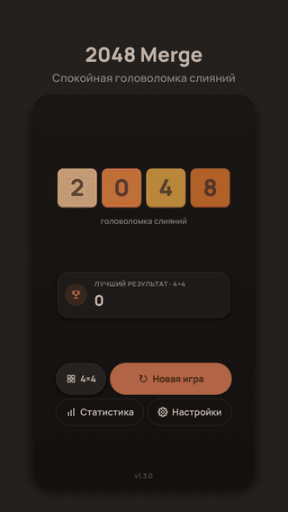

<br><br>

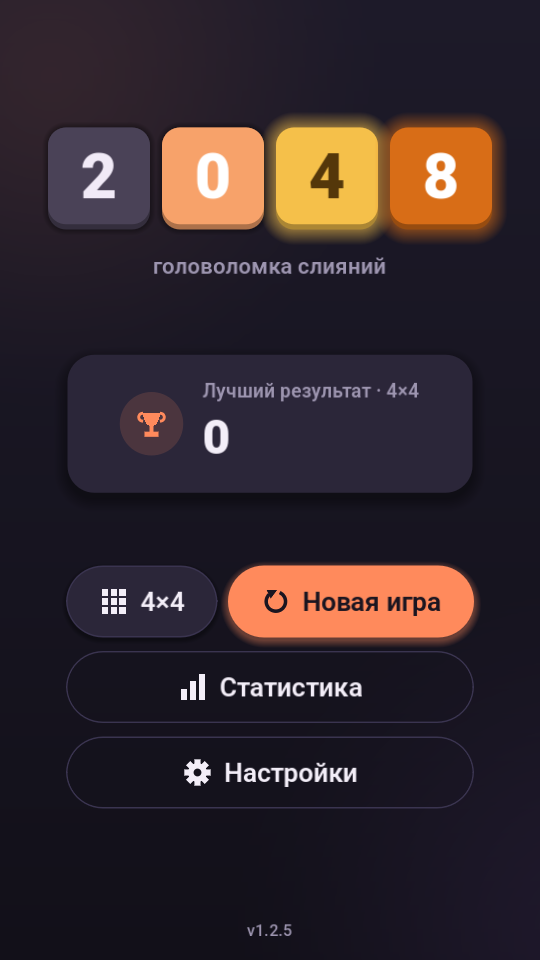 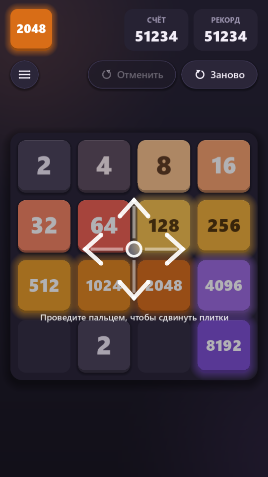 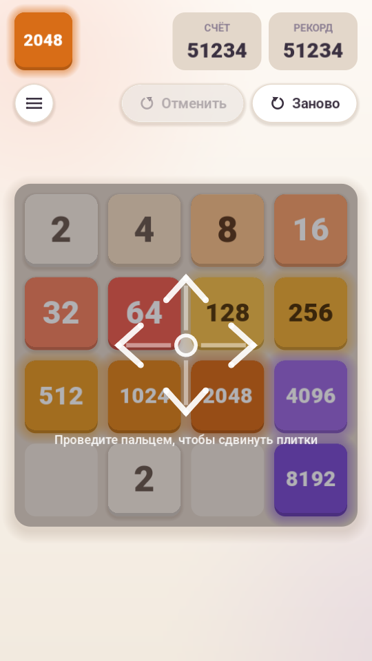 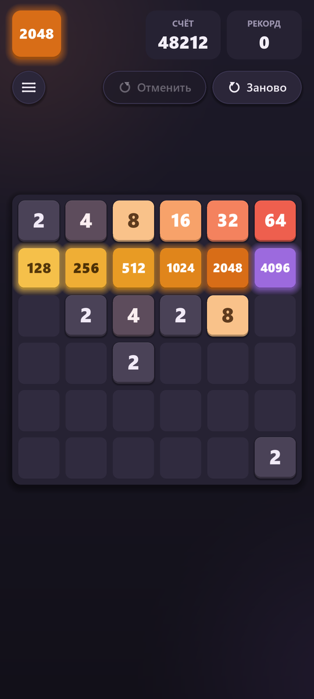

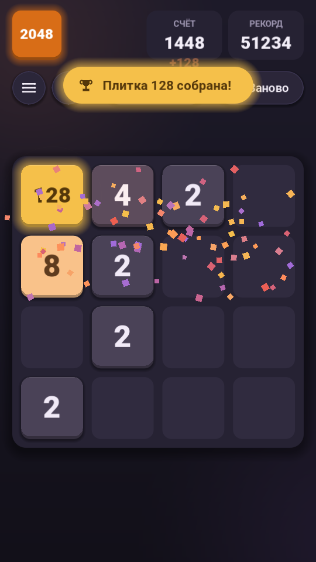 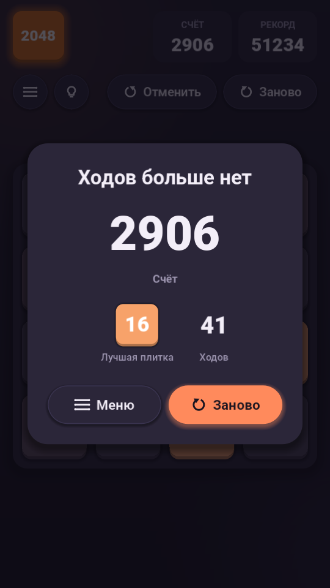 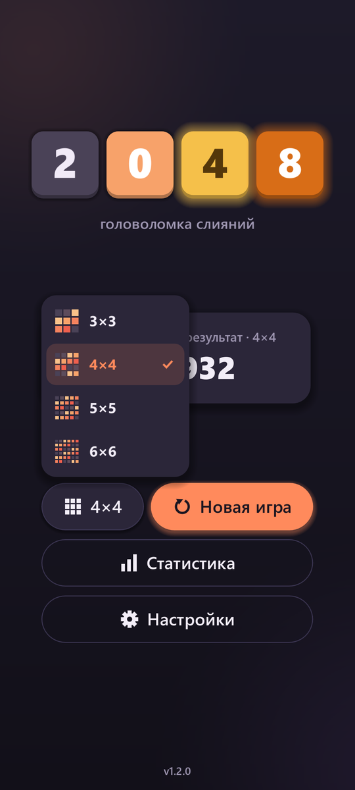 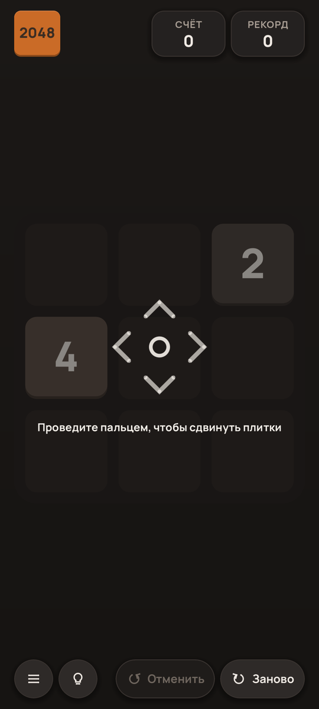

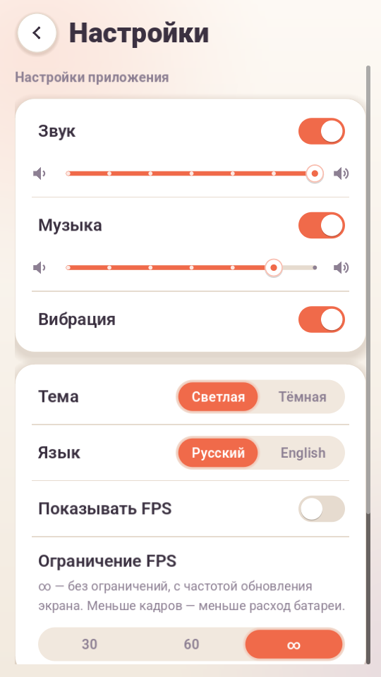 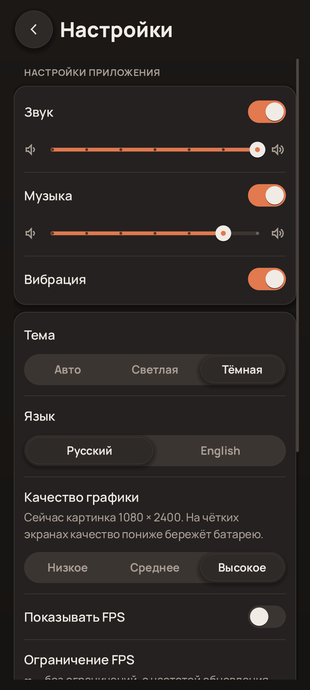 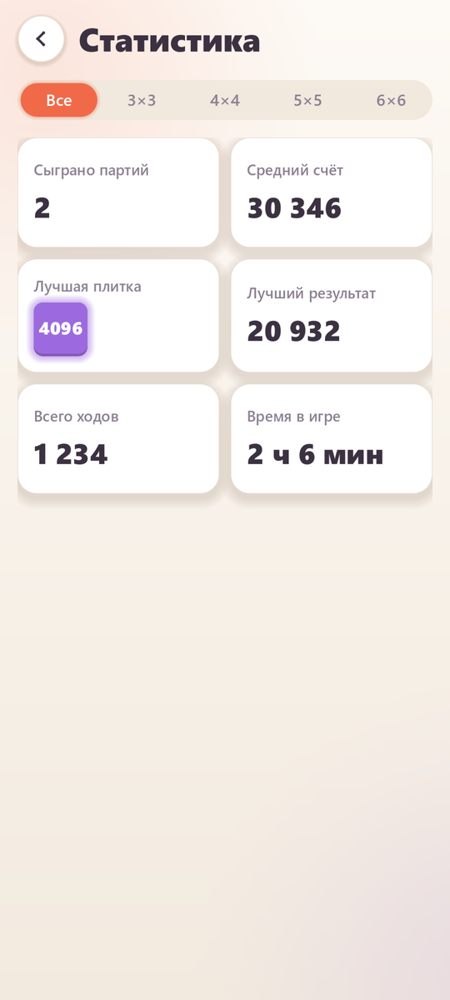 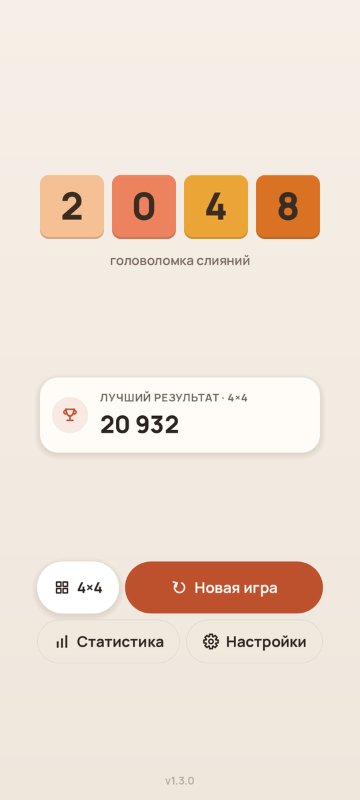

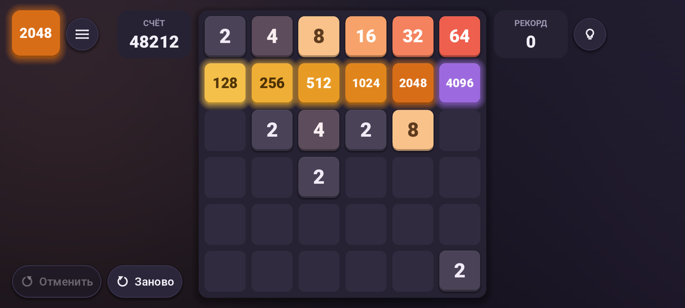

</div>

---

<div align="center">
<sub>Copyright © 2026 Lev Burmistrov (Mahiron-hq)</sub>
</div>
